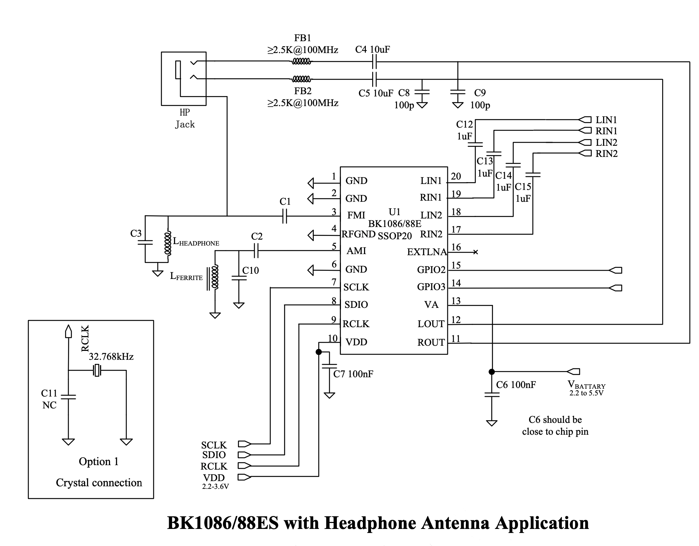
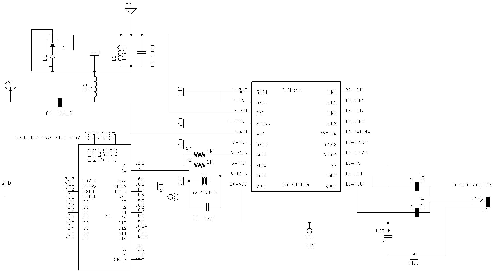

# PU2CLR BK108X Arduino Library

The BK1086 and BK1088 are DSP receivers from BAKEN. The BK1088 is a BROADCAST FM and AM (LW, MW and ) RECEIVER and BK1086 is a subset of the BK1088 (it does not have LW and SW acording to the Datasheet).  

This project is about an Arduino Library to control the BK1086 and BK1088 devices. It was based on "BK1086/88E BROADCAST AM/FM/SW/LW RADIO RECEIVER; Rev.1.3" documentation from BEKEN Corporation.

__This library is under construction...__

This library can be freely distributed using the MIT Free Software model. 

[Copyright (c) 2019 Ricardo Lima Caratti](https://pu2clr.github.io/bk108X/#mit-license). 

Contact: __pu2clr@gmail.com__.

## Contents

1. [Preface](https://github.com/pu2clr/BK108X#preface)
2. [BK1086/88 features]()
3. [Library Installation]()
4. [API Documentation]()
5. [Schematic](https://github.com/pu2clr/BK108X#schematic)
6. [Sketch examples](examples/)
7. [References]()

## Preface 

At the end of 2019 I started some Arduino library development projects to control DSP receivers. The first implementation was the Arduino library for the SI4844 and then for the ICx Si473X family, all manufactured by Silicon Labs. Given the acceptance and enthusiasm of various radio listeners, experimenters and hobbyists, around the use of the implementations of these libraries, I decided to expand the number of Arduino libraries for the Arduino IDE platform and also developed the libraries for the AKC695X, KT0915, SI470X and RDA5807. When I started reading about the BK1086/88 Datasheet I notice it is also very apropriated for radio listener and hobbyists. Unlik the other devices previously mentioned, I found very few documentation about it. So, it encouraged me to build as much information as possible about this BEKEN family of devices. I requested some information about the BK1086/88E from BEKEN Corporation and I was promptly answered. I would like to thank the BEKEN Corporation fot its attention. 

This library is based on the BEKEN manual “BK1086/88 - BROADCAST AM/FM/SW/LW RADIO RECEIVER REV1.3” provided by BEKEN Corporation and experiments made by me during the development process. 

__This library is under construction...__

### See also

1. [PU2CLR Si4735 Library for Arduino](https://pu2clr.github.io/SI4735/). This library was built based on “Si47XX PROGRAMMING GUIDE; AN332” and it has support to FM, AM and SSB modes (LW, MW and SW). It also can be used on all members of the SI47XX family respecting, of course, the features available for each IC version; 
2. [PU2CLR SI4844 Arduino Library](https://github.com/pu2clr/SI4844). This is an Arduino library for the SI4844, BROADCAST ANALOG TUNING DIGITAL DISPLAY AM/FM/SW RADIO RECEIVER,  IC from Silicon Labs.  It is available on Arduino IDE. This library is intended to provide an easier interface for controlling the SI4844.
3. [PU2CLR AKC695X Arduino Library](https://pu2clr.github.io/AKC695X/). The AKC695X is a family of IC DSP receiver from AKC technology. The AKC6955 and AKC6959sx support AM and FM modes. On AM mode the AKC6955 and AKC6959sx work on LW, MW and SW. On FM mode they work from 64MHz to 222MHz.
4. [PU2CLR KT0915 Arduino Library](https://pu2clr.github.io/KT0915/). The KT0915 is a full band AM (LW, MW and SW) and FM DSP receiver that can provide you a easy way to build a high quality radio with low cost. 
5. [PU2CLR RDA5807 Arduino Library](https://pu2clr.github.io/RDA5807/). The RDA5807 is a FM DSP integrated circuit receiver (50 to 115MHz) with low noise amplifier support. This device requires very few external components if compared with other similar devices. It also supports RDS/RBDS functionalities, direct auto gain control (AGC) and real time adaptive noise cancellation function.
6. [PU2CLR SI470X Arduino Library](https://pu2clr.github.io/SI470X/). It is a Silicon Labs device family that integrates the complete functionalities for FM receivers, including RDS (Si4703).

## MIT License 

Copyright (c) 2019 Ricardo Lima Caratti

Permission is hereby granted, free of charge, to any person obtaining a copy of this software and associated documentation files (the "Software"), to deal in the Software without restriction, including without limitation the rights to use, copy, modify, merge, publish, distribute, sublicense, and/or sell copies of the Software, and to permit persons to whom the Software is furnished to do so, subject to the following conditions:

The above copyright notice and this permission notice shall be included in all copies or substantial portions of the Software.

THE SOFTWARE IS PROVIDED "AS IS", WITHOUT WARRANTY OF ANY KIND, EXPRESS OR IMPLIED, INCLUDING BUT NOT LIMITED TO THE ARRANTIES OF MERCHANTABILITY, FITNESS FOR A PARTICULAR PURPOSE AND NONINFRINGEMENT. IN NO EVENT SHALL THE AUTHORS OR COPYRIGHT HOLDERS BE LIABLE FOR ANY CLAIM, DAMAGES OR OTHER LIABILITY, WHETHER IN AN ACTION OF CONTRACT, TORT OR OTHERWISE, ARISING FROM, OUT OF OR IN CONNECTION WITH THE SOFTWARE OR THE USE OR OTHER DEALINGS IN THE SOFTWARE.

 

## Thanks

Mr. Peng Roy, from BEKEN Corporation, for providing me with the technical information on the BK1086/88.

## Your support is important

If you have suggestions to improve this project, please let me know. 

## BK1086/88 features

### Main features

1. Worldwide 64~108 MHz FM band support;
2. Worldwide 520~1710kHz AM band support;
3. LW band support(153-279kHz,BK1088E only)
4. SW band support(2.3-21.85MHz, BK1088E only);
5. Automatic gain control(AGC);
6. Automatic frequency control(AFC);
7. Digital FM stereo decoder;
8. Automatic FM stereo/mono blend;
9. Automatic noise suppression;
10. 50us/75us de-emphasis;
11. RDS/RBDS decoder;
12. 2.4 ~ 5.5 V supply voltage;
13. Wide range reference clock support;
14. 32.768KHz crystal oscillator.

### Useful informarion

* BK1086/88 can be controlled by an MCU through 2-wire I2C mode.  BK1086/88 always gets the data on the SDIO line on the rising edge of the SCLK signal, and outputs data to the SDIO line on the falling edge of the SCLK signal. So for MCU, it is necessary to output data to SDIO on the falling edge of SCLK, and read the data on SDIO after the rising edge of SCLK;
* In I2C mode, SCLK is the clock signal, SDIO is the data signal, SEN is invalid, this pin can be connected to high voltage Flat or floating. An I2C read and write operation starts from the Start condition and ends with the Stop condition. After Start, the MCU needs to SDIO outputs an 8-bit Device ID, and the Device ID of BK1086/88 is 0x80.
After outputting the Device ID, the MCU continues to output an 8-bit control word to SDIO. The control word starts from 7 bits. Start register address, and a read and write bit (read operation is 1, write operation is 0). For example: the starting register address is 0x03, and data needs to be read from Device, then ControlWord=(0x03<<1+1)=0x07. After outputting the control word, you can write data to SDIO data (write operation) or get data from SDIO (read operation). When MCU writes data, after writing a byte each time, Device will output a low level ACK signal. When MCU reads data, after reading a byte each time, MCU must output an ACK signal to BK1086/88; and after outputting the last data, MCU needs to give NACK signal to BK1086/88;
* BK1086/88 has an internal automatic tuning technology, which can automatically adjust the internal variable capacitance value to make the resonant circuit in the best resonance state at the current operating frequency, thus greatly simplifying the design of the AM antenna end;
* BK1086 only supports FM and medium wave, BK1088 supports short wave and long wave in addition to FM and medium wave;
* The input DC operating point of the front-end low noise amplifier of the BK1086/88 chip has been internally set to 0V. and so When using ground wire as antenna input, DC blocking capacitor is not needed. If there is a DC blocking capacitor (FM mode>100pF, medium wave mode>270nF) in the external circuit design, it will not affect the receiving performance;
* Adding an LC resonant circuit can better improve the FM receiving sensitivity. If there is a higher requirement for this performance, you must Join;
* If the control mode is I2C mode, SEN pin can be connected high or left floating. MODE pin can Ground directly.
* There is already a 40K pull-up resistor inside the chip for the SEN, SCLK and SDIO. So, in general, no external pull-up resistor is needed. In international applications, the communication failure may be caused by weak external main control platform drive or long wiring of these three control signals. Under these conditions, it is necessary to reduce the pull-up resistor value;
* The BK1086/88 chip requires input clock accuracy <200ppm. When the external input clock frequency is 32.768KHz
When, the required peak-to-peak clock signal is greater than 750mV. When the external input clock frequency is 24MHz, the peak-to-peak value of the clock signal required by BK1086/88 is greater than 1.35V. The waveform of the clock signal is not limited.

### Similarities and differences between BK1088 and BK1088E

* BK1088 needs to initialize 41 registers, while BK1088E only needs to initialize 33 registers. And initialize the list
The register value is also different. Same point: Except for the initialization list, the other codes are the same, including setting the frequency, setting the volume, and the threshold of automatic station search;
* Compared with BK1088, BK1088E has an overall improvement in sensitivity. AM sensitivity has been increased by about 2dB and FM sensitivity has been increased by about 3dB.
  

## Library Installation

__Under construction.....__

## Schematic

### BEKEN Typical Application Schematic

The image below was extracted from "BK1086/88E BROADCAST AM/FM/SW/LW RADIO RECEIVER; Rev.1.3; page 25". It is a basic circuit suggested by BEKEN.

The schematic below is based on the BEKEN typical application schematic added to the Arduino controller. The front-end circuit has been modified to use regular antenna instead headphone antenna setup.  

The main porpuse of this circuit is to test the  BK108X Arduino Library. However, you may be surprised at the performance of this simple circuit due to the high features of the BK1086/88 device. Also, it is importante to say that this receiver does not intend to be a real radio for exigent listener. However, it is possible to start with it and then, if you wish, you can include some devices to the circuit to improve, for example,  its sensibility, output sound quality beyond other desired features.

__Schematic under construction....__

## References

* BK1086/88E - BROADCAST AM/FM/SW/LW RADIO RECEIVER; Rev 1.3 (Copyright©2012 by Beken Corporation);
* BK1086/88 Application Manual (In Chines - Copyright©2012 by Beken Corporation);
* [1201682 Radio Alarm Clock with Bluetooth Speaker / Bluetooth Alarm Clock Radio Schematics Circuit Diagram Shenzhen Great Power Enterprise](https://fccid.io/ZY9-1201682/Schematics/Circuit-Diagram-2803394);
* [AudioComm RAD-F630Z](http://nice.kaze.com/rad-f630z.html);
  

